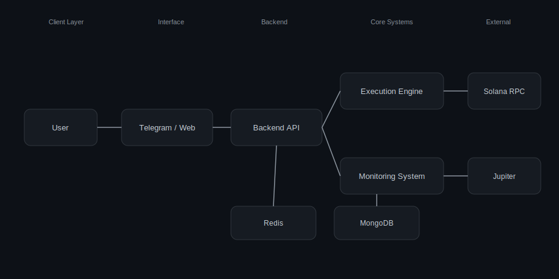

# Daisy Banks

**Senior Backend Engineer — Solana Trading Infrastructure**

I design and operate low-latency execution systems, real-time market monitoring pipelines, and scalable backend services for on-chain trading environments.

---

## ⚙️ Tech Stack

**Backend & Language**  

  
  
  

**Blockchain**  

  

**Data & Infrastructure**  

  
  
  

---

## 🚀 Live Systems

- Telegram Bot → https://t.me/Saturnsolbot  
- Web App → https://saturnsolbot-web.up.railway.app  

---

## 🧠 What I Build

- **Execution Engines**  
  Low-latency transaction pipelines with RPC routing, retry logic, and failover strategies optimized for Solana

- **Trading Infrastructure**  
  Sniper bots, automated execution systems, and scalable multi-user trading platforms

- **Market Monitoring Systems**  
  Real-time token tracking using aggregator APIs with efficient batched refresh pipelines

- **Backend Systems**  
  High-performance Node.js / TypeScript services built for concurrency, resilience, and throughput

- **Data Layer**  
  MongoDB (persistent state)  
  Redis (caching, queues, high-speed access)

---

## ⚙️ Architecture Focus
## 🧠 System Architecture

